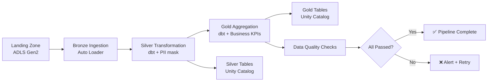

<p align="center">
  <h1 align="center">🏗️ Azure Databricks Pipeline Templates</h1>
  <p align="center">
    <strong>Production-grade, Unity Catalog-configured, dbt-transformed, Terraform-deployed</strong>
  </p>
  <p align="center">
    <a href="#-architecture"></a>
    <a href="LICENSE"></a>
    <a href="#-quick-start"></a>
  </p>
</p>

---

## Overview

End-to-end Azure Databricks pipeline templates built for **XamXam Graph** data engineering clients. Deploy a full medallion architecture (Bronze → Silver → Gold) with Unity Catalog governance, dbt transformations, and infrastructure-as-code in under 30 minutes.

**Why this exists:** Most Databricks projects start from scratch — stitching together VNets, Unity Catalog, dbt, and CI/CD. This repo is the template that eliminates that boilerplate. Every module is production-tested, documented, and ready for customer demos.

## ✨ Key Features

| Capability                 | Implementation                                                                                       |
| -------------------------- | ---------------------------------------------------------------------------------------------------- |
| **Infrastructure as Code** | Terraform modules — VNet, ADLS Gen2, Databricks, Unity Catalog, Key Vault                            |
| **Data Governance**        | Unity Catalog with 3-tier catalog hierarchy (bronze/silver/gold), RBAC grants, external locations    |
| **Medallion Architecture** | Bronze (raw ingestion) → Silver (cleansed/PII-masked) → Gold (business KPIs)                         |
| **dbt Transformations**    | 20+ dbt models — staging, incremental, SCD Type 2 snapshots, macros for surrogate keys & PII masking |
| **Pipeline Orchestration** | Databricks Workflows with 5-task DAG — ingestion → dbt silver → dbt gold → data quality              |
| **Data Quality**           | Automated DQ checks — row counts, freshness, null ratios, anomaly detection                          |
| **CI/CD**                  | GitHub Actions — Terraform fmt/validate/tflint, dbt compile/test                                     |
| **Security**               | VNet injection, private endpoints, service principal auth, Key Vault secrets, PII masking (SHA-256)  |
| **Multi-Environment**      | Dev/Staging/Prod with environment-specific configurations                                            |
| **Cost Optimization**      | Spot instances, auto-termination, autoscaling, SQL warehouse auto-stop                               |

## 🏛 Architecture

```
┌─────────────────────────────────────────────────────────────┐
│                    Azure Landing Zone                       │
├─────────────────────────────────────────────────────────────┤
│  VNet (10.0.0.0/16)                                        │
│  ├── Public Subnet  (10.0.1.0/24)                          │
│  └── Private Subnet (10.0.2.0/24) — Databricks workspace   │
├─────────────────────────────────────────────────────────────┤
│  ┌──────────────────┐  ┌─────────────┐  ┌──────────────┐  │
│  │  ADLS Gen2       │  │  Key Vault  │  │  NSG          │  │
│  │  ├── bronze/     │  │  (secrets)  │  │  (firewall)   │  │
│  │  ├── silver/     │  └─────────────┘  └──────────────┘  │
│  │  ├── gold/       │                                      │
│  │  └── checkpoint/ │                                      │
│  └──────────────────┘                                      │
├─────────────────────────────────────────────────────────────┤
│  Databricks Workspace (Premium SKU)                        │
│  ├── Unity Catalog Metastore                               │
│  ├── External Locations (ADLS mount)                       │
│  ├── Clusters (all-purpose, jobs, spot)                    │
│  ├── SQL Warehouse                                         │
│  └── Workflows (Medallion DAG)                             │
└─────────────────────────────────────────────────────────────┘
```

### Medallion Pipeline DAG



### Unity Catalog Hierarchy

```
metastore-{env}
├── bronze (catalog)
│   ├── sales.raw_sales_transactions
│   ├── customers.raw_customer_profiles
│   ├── operations.raw_inventory_movements
│   ├── customers.raw_web_events
│   └── iot.raw_iot_sensor_readings
├── silver (catalog)
│   ├── sales.sales_transactions_cleaned
│   ├── customers.customers_cleaned
│   ├── operations.inventory_snapshots
│   ├── marketing.web_sessions_enriched
│   └── iot.iot_readings_validated
└── gold (catalog)
    ├── sales.daily_sales_summary
    ├── customers.customer_360
    ├── operations.inventory_health
    ├── marketing.web_conversion_funnel
    └── iot.iot_anomaly_dashboard
```

## 🚀 Quick Start

### Prerequisites

- Azure subscription with Contributor role
- [Terraform](https://developer.hashicorp.com/terraform/downloads) ≥ 1.5.0
- [Azure CLI](https://docs.microsoft.com/cli/azure/install-azure-cli) logged in
- [Databricks CLI](https://docs.databricks.com/dev-tools/cli/index.html) (optional, for workflow deployment)
- [dbt-databricks](https://github.com/databricks/dbt-databricks) or the Fusion-compatible Databricks adapter (for local development)

### 1. Clone the Repository

```bash
git clone https://github.com/ibfaye/azure-databricks-pipeline-templates.git
cd azure-databricks-pipeline-templates
```

### 2. Configure Terraform

```bash
cd terraform
cp terraform.tfvars.example terraform.tfvars
```

Edit `terraform.tfvars` with your values:

```hcl
azure_subscription_id = "your-subscription-id"
azure_tenant_id       = "your-tenant-id"
databricks_account_id = "your-databricks-account-id"
environment           = "dev"
location              = "westeurope"
```

### 3. Deploy Infrastructure (Two Phases)

```bash
# Phase 1 — Core infra + workspace
terraform init
terraform apply

# Phase 2 — Clusters + jobs + SQL warehouse
# Add to terraform.tfvars: deploy_workspace_resources = true
terraform apply
```

> ⚠️ **See [`DEPLOY.md`](DEPLOY.md) for known issues**: Azure quota, Unity Catalog setup, NSG conflicts, and troubleshooting.

**What Phase 1 creates (~12 min):**
- Resource Group
- VNet + Subnets + NSG (empty — Databricks manages rules via NIPs)
- ADLS Gen2 with 7 containers (bronze, silver, gold, landing, checkpoint, metastore)
- Key Vault with access policy
- Databricks Workspace (Premium, VNet-injected)
- Medallion Workflow (scheduled)

### 4. Configure dbt

```bash
cd ../dbt
cp profiles.yml.example profiles.yml

# Set environment variables
export DATABRICKS_HOST=$(terraform -chdir=../terraform output -raw databricks_workspace_url)
export DATABRICKS_HTTP_PATH="/sql/1.0/warehouses/$(terraform -chdir=../terraform output -raw sql_warehouse_id)"
export DATABRICKS_TOKEN="your-personal-access-token"
```

### 5. Run dbt Models

```bash
dbt deps       # Install packages
dbt compile    # Validate SQL
dbt run        # Run all models (bronze → silver → gold)
dbt test       # Run data quality tests
```

## 📊 Use Cases

| Industry                | Use Case                                                      | Models Used                                                                        |
| ----------------------- | ------------------------------------------------------------- | ---------------------------------------------------------------------------------- |
| **Retail / E-commerce** | Sales analytics, customer 360, inventory optimization         | `daily_sales_summary`, `customer_360`, `inventory_health`, `web_conversion_funnel` |
| **IoT / Manufacturing** | Predictive maintenance, sensor anomaly detection              | `iot_readings_validated`, `iot_anomaly_dashboard`                                  |
| **Financial Services**  | Transaction monitoring, fraud detection, regulatory reporting | `sales_transactions_cleaned` (with PII masking), audit snapshots                   |
| **Marketing / MarTech** | Attribution modeling, campaign ROI, user behavior analysis    | `web_sessions_enriched`, `web_conversion_funnel`, `customer_360`                   |
| **Supply Chain**        | Real-time inventory, demand forecasting, supplier analytics   | `inventory_snapshots`, `inventory_health`                                          |

See [`docs/use-cases/`](docs/use-cases/) for detailed scenario walkthroughs.

## 📁 Project Structure

```
azure-databricks-pipeline-templates/
├── terraform/                        # Infrastructure as Code
│   ├── main.tf                       # Root module — orchestrates all resources
│   ├── variables.tf                  # Input variables
│   ├── outputs.tf                    # Workspace URL, storage, KV outputs
│   ├── providers.tf                  # azurerm, databricks, azuread
│   ├── terraform.tfvars.example      # Example variable values
│   └── modules/
│       ├── azure-resources/          # VNet, ADLS, Key Vault, NSG
│       ├── databricks-workspace/     # Workspace, Unity Catalog, RBAC
│       └── databricks-cluster/       # All-purpose, jobs, spot clusters
├── dbt/                              # dbt transformations
│   ├── dbt_project.yml              # dbt project config — UC catalog routing
│   ├── packages.yml                  # dbt_utils, dbt_expectations, etc.
│   ├── profiles.yml.example          # Connection profiles (dev/staging/prod)
│   ├── macros/
│   │   └── utils.sql                 # Surrogate keys, PII masking, audit columns
│   └── models/
│       ├── bronze/                   # Raw staging views (5 models)
│       ├── silver/                   # Cleansed incremental tables (5 models)
│       └── gold/                     # Business aggregation tables (5 models)
├── pipelines/                        # Databricks pipeline code
│   ├── notebooks/
│   │   ├── bronze_ingestion.py       # Auto Loader + Unity Catalog writes
│   │   ├── silver_transformation.py  # Dedup, validate, PII mask, dbt
│   │   ├── gold_aggregation.py       # Business KPIs, customer 360
│   │   └── data_quality.py           # Reconciliation, freshness, nulls
│   ├── workflows/
│   │   ├── medallion_pipeline.yml    # Full DAG definition (Databricks CLI)
│   │   └── incremental_load.yml      # Hourly delta loads
│   └── src/                          # Python SDK
│       ├── config.py                 # Centralized config (secrets, widgets, env)
│       ├── readers.py                # ADLS, Event Hubs, Auto Loader
│       ├── transformers.py           # Dedup, PII mask, data quality
│       └── writers.py                # Delta, Unity Catalog, streaming
├── docs/                             # Documentation
│   ├── architecture.md               # Detailed architecture decisions
│   ├── getting-started.md            # Step-by-step onboarding
│   └── use-cases/                    # Customer-facing scenario docs
├── .github/workflows/                # CI/CD
│   ├── terraform-validate.yml        # fmt, validate, tflint, docs
│   └── dbt-ci.yml                    # dbt compile, test
├── .gitignore
├── LICENSE                           # MIT
└── README.md                         # You are here
```

## 🔐 Security

| Layer               | Implementation                                                               |
| ------------------- | ---------------------------------------------------------------------------- |
| **Network**         | VNet injection, private subnets, NSG rules for Databricks control plane only |
| **Authentication**  | Azure AD service principal — no static credentials in code                   |
| **Secrets**         | Azure Key Vault — ADLS keys, SP secrets, 90-day rotation                     |
| **Data at Rest**    | ADLS Gen2 encryption, TLS 1.2 minimum                                        |
| **Data in Transit** | HTTPS only, no public IP on Databricks workspace                             |
| **PII Protection**  | SHA-256 hashing with salt in silver layer, complete PII removal in gold      |
| **Access Control**  | Unity Catalog grants — admin (ALL_PRIVILEGES) vs reader (SELECT only)        |
| **Audit**           | `_loaded_at`, `_loaded_by`, `_databricks_runtime_version` on every row       |

## 📈 Observability

- **Databricks Jobs UI**: Pipeline run history, duration, retries
- **Email Alerts**: On pipeline failure to `data-engineering@company.com`
- **Data Quality Reports**: Written to Delta table at `checkpoint/data_quality_reports/`
- **dbt Artifacts**: `run_results.json`, `manifest.json` for lineage
- **Azure Monitor**: Resource metrics, log analytics (configurable)

## 🛠 Development

### Local Development

```bash
# Python SDK
cd pipelines
python -m pip install -e ".[dev]"

# dbt development
cd dbt
dbt compile --target dev
dbt run --select bronze.* --target dev

# Terraform linting
cd terraform
terraform fmt -recursive
tflint --recursive
```

### Adding a New Data Source

1. **Terraform**: Add storage container in `modules/azure-resources/main.tf`
2. **Bronze model**: Add staging SQL in `dbt/models/bronze/`
3. **Silver model**: Add cleansing SQL in `dbt/models/silver/`
4. **Gold model**: Add aggregation SQL in `dbt/models/gold/`
5. **Notebook**: Add ingestion cell in `pipelines/notebooks/bronze_ingestion.py`
6. **Workflow**: Add task to `pipelines/workflows/medallion_pipeline.yml`

### Git Workflow

```bash
git checkout -b feature/new-data-source
# ... make changes ...
git add .
git commit -m "feat: add weather data pipeline"
git push origin feature/new-data-source
# Open PR — CI will run terraform validate + dbt compile
```

## 📚 References

- [Databricks Terraform Provider](https://registry.terraform.io/providers/databricks/databricks/latest/docs)
- [Azure Terraform Provider](https://registry.terraform.io/providers/hashicorp/azurerm/latest/docs)
- [Unity Catalog Documentation](https://docs.databricks.com/data-governance/unity-catalog/index.html)
- [dbt-databricks Adapter](https://github.com/databricks/dbt-databricks) / Fusion-compatible dbt adapter
- [Medallion Architecture](https://www.databricks.com/glossary/medallion-architecture)

## 👤 About

Built by [XamXam Graph](https://xamxamgraph.com) — a data engineering agency based in Dakar, Senegal, serving Francophone West Africa. We specialize in Azure Databricks, dbt, and modern data stack implementations for enterprises across retail, finance, IoT, and marketing.

**Contact:** iboufaye2000@hotmail.com  
**GitHub:** [github.com/ibfaye](https://github.com/ibfaye)

---

<p align="center">
  <strong>⚡ Deploy a production data platform in 30 minutes, not 3 months.</strong>
</p>
