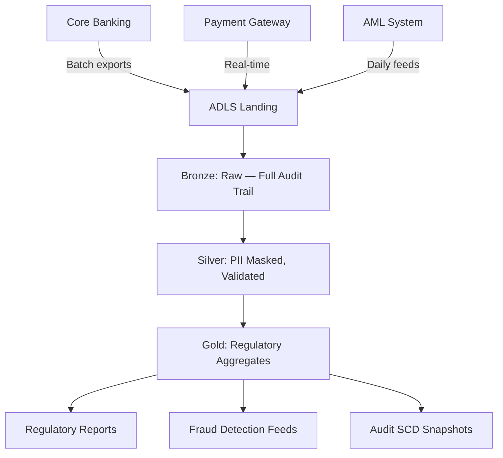

# Use Case: Financial Services & Compliance

**Industry:** Banking, Insurance, Fintech  
**Data Sources:** Core banking systems, payment gateways, AML feeds  
**Goal:** Transaction monitoring, regulatory reporting, audit trail

## Pipeline Flow



## Compliance Features

| Feature | Implementation |
|---------|---------------|
| **Audit Trail** | `_loaded_at`, `_loaded_by`, `_databricks_runtime_version` on every row |
| **SCD Type 2** | dbt snapshots with `dbt_valid_from`/`dbt_valid_to` for slowly changing dimensions |
| **PII Protection** | SHA-256 hashing of customer identifiers in Silver; complete removal in Gold |
| **Data Lineage** | dbt manifest (`manifest.json`) provides full column-level lineage |
| **Immutability** | Bronze layer is append-only — never overwritten |
| **Retention** | Delta time travel (30 days default), ADLS soft delete (7 days) |

## Models Engaged

| Layer | Model | Purpose |
|-------|-------|---------|
| Bronze | `stg_sales_transactions` | Raw transactions — never deleted |
| Silver | `sales_transactions_cleaned` | Validated, deduped, PII-hashed |
| Gold | `daily_sales_summary` | Daily aggregates for regulatory reporting |
| Gold | `customer_360` | Customer risk scoring (with churn risk → fraud risk adaptation) |

## Key Controls

1. **Segregation of Duties**: Bronze write (service principal) ≠ Silver write (dbt) ≠ Gold read (analysts)
2. **Data Quality Gates**: Pipeline fails if null ratios exceed 5% or freshness > 48 hours
3. **Reconciliation**: Bronze row count compared to source system row count in DQ notebook
4. **Change Data Capture**: `delta.enableChangeDataFeed = true` on Silver tables for incremental consumers

## Sample Audit Query

```sql
-- Reconstruct a specific transaction's history
SELECT *
FROM silver.sales.sales_transactions_cleaned
  VERSION AS OF '2025-06-01T00:00:00Z'
WHERE transaction_id = 'TXN-12345';
```
