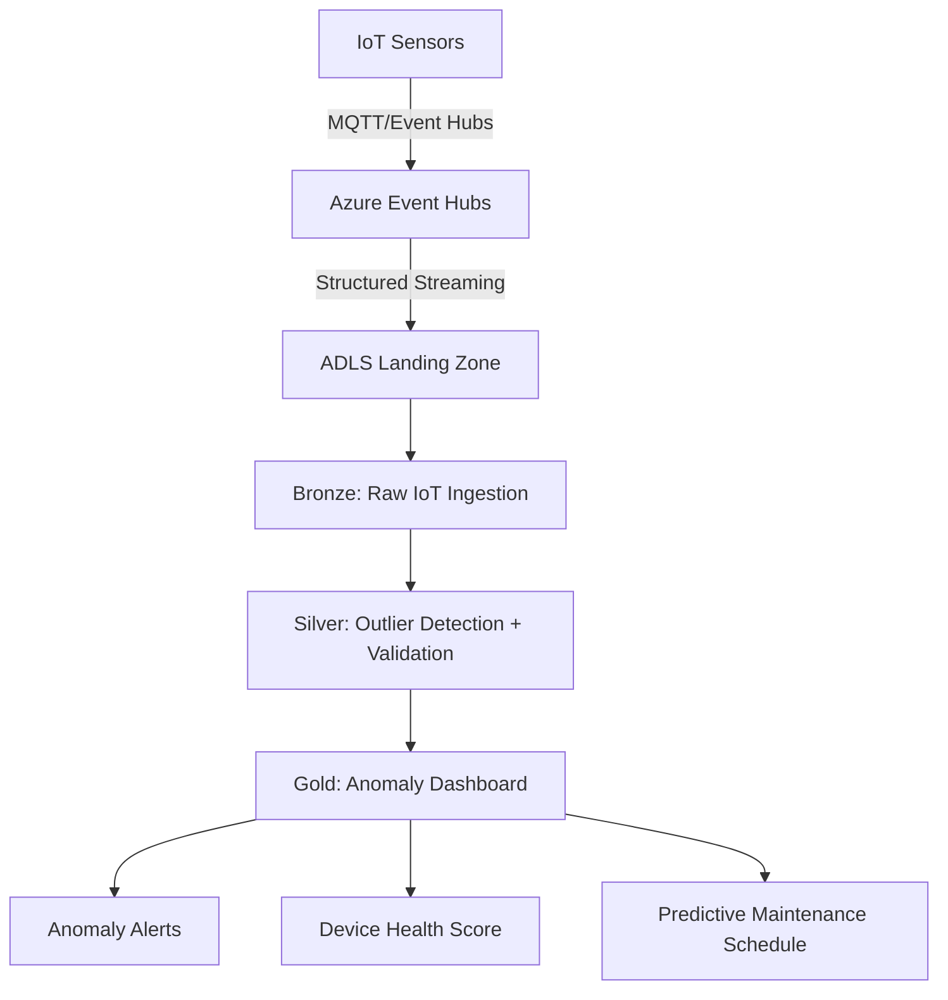

# Use Case: IoT & Predictive Maintenance

**Industry:** Manufacturing, Energy, Smart Buildings  
**Data Sources:** IoT sensors (temperature, vibration, humidity, pressure)  
**Goal:** Real-time anomaly detection, predictive maintenance, device fleet health

## Pipeline Flow



## Models Engaged

| Layer | Model | Purpose |
|-------|-------|---------|
| Bronze | `stg_iot_readings` | Raw sensor telemetry |
| Silver | `iot_readings_validated` | Z-score outlier flagging, gap detection |
| Gold | `iot_anomaly_dashboard` | 7-day anomaly rate, battery health, device gaps |

## Key Metrics

| Metric | Column | Threshold |
|--------|--------|-----------|
| Z-score | `z_score` | > 3 = outlier |
| Anomaly rate (7d) | `anomaly_rate_7d_pct` | > 10% = device alert |
| Battery level | `avg_battery_level` | < 20% = low battery |
| Data gaps | `hours_since_last` | > 24h = offline device |

## Sample Queries

```sql
-- Devices with high anomaly rates
SELECT device_id, sensor_type, anomaly_rate_7d_pct, avg_battery_level
FROM gold.iot.iot_anomaly_dashboard
WHERE report_date = current_date()
  AND anomaly_rate_7d_pct > 10
ORDER BY anomaly_rate_7d_pct DESC;

-- Devices that have gone offline
SELECT device_id, sensor_type, hours_since_last, last_reading
FROM gold.iot.iot_anomaly_dashboard
WHERE report_date = current_date()
  AND hours_since_last > 24
ORDER BY hours_since_last DESC;

-- Temperature outlier events (last 7 days)
SELECT device_id, reading_timestamp, reading_value_raw, z_score
FROM silver.iot.iot_readings_validated
WHERE sensor_type = 'temperature'
  AND is_outlier = TRUE
  AND reading_date >= current_date() - 7;
```

## Alert Integration

The Gold anomaly dashboard can feed into:
- **Azure Monitor** alerts (via log analytics)
- **PagerDuty / Opsgenie** (via webhook)
- **Power Automate** (maintenance ticket creation)
- **Teams / Slack** (daily anomaly digest)
