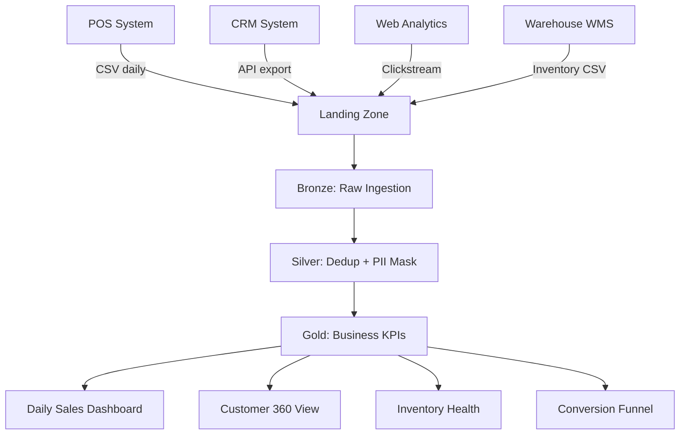

# Use Case: Retail & E-Commerce Analytics

**Industry:** Retail, E-Commerce  
**Data Sources:** POS transactions, CRM, web analytics, inventory management  
**Goal:** 360° customer view, real-time inventory, conversion optimization

## Pipeline Flow



## Models Engaged

| Layer | Model | Purpose |
|-------|-------|---------|
| Bronze | `stg_sales_transactions` | Raw POS data ingestion |
| Bronze | `stg_customer_profiles` | CRM customer master |
| Bronze | `stg_web_events` | Clickstream data |
| Bronze | `stg_inventory_movements` | Stock movements |
| Silver | `sales_transactions_cleaned` | Deduped, PII-hashed transactions |
| Silver | `customers_cleaned` | Standardized, masked customer profiles |
| Silver | `web_sessions_enriched` | Bot-filtered, sessionized events |
| Silver | `inventory_snapshots` | Daily stock positions |
| Gold | `daily_sales_summary` | Revenue, AOV, MoM growth |
| Gold | `customer_360` | LTV, RFM segments, churn risk |
| Gold | `inventory_health` | Days-on-hand, stockout risk, ABC |
| Gold | `web_conversion_funnel` | Visit → Cart → Purchase rates |

## Key Business Questions Answered

| Question | Gold Table | Metric |
|----------|-----------|--------|
| What's our daily revenue by store/currency? | `daily_sales_summary` | `total_revenue_usd`, `order_count` |
| Who are our most valuable customers? | `customer_360` | `lifetime_value`, `customer_segment` |
| Which customers are about to churn? | `customer_360` | `churn_risk_score`, `recency_days` |
| Which products are at risk of stocking out? | `inventory_health` | `days_on_hand`, `stockout_risk` |
| What's our checkout conversion rate? | `web_conversion_funnel` | `purchase_rate_pct`, `cart_rate_pct` |
| Which marketing channels drive purchases? | `web_conversion_funnel` | `funnel_date`, `country_code`, `device_type` |

## Sample Queries

```sql
-- Top 10 customers by LTV
SELECT customer_id, lifetime_value, customer_segment
FROM gold.customers.customer_360
WHERE customer_segment != 'never_purchased'
ORDER BY lifetime_value DESC
LIMIT 10;

-- Stockout risk today
SELECT product_sku, quantity_on_hand, days_on_hand, stockout_risk
FROM gold.operations.inventory_health
WHERE stockout_risk IN ('stocked_out', 'critical');

-- Conversion funnel this week
SELECT funnel_date, overall_conversion_pct, purchase_rate_pct
FROM gold.marketing.web_conversion_funnel
WHERE funnel_date >= current_date() - 7
ORDER BY funnel_date DESC;
```

## PII Compliance

All customer PII is hashed at the Silver layer. Gold tables contain zero PII — safe for BI tools and data sharing.
